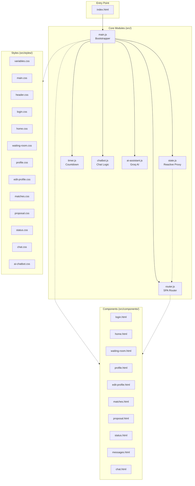
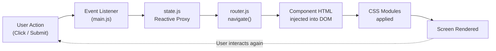
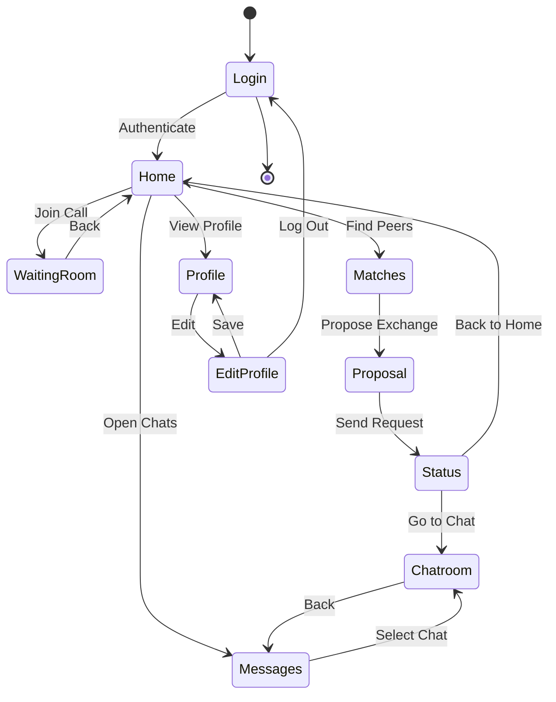
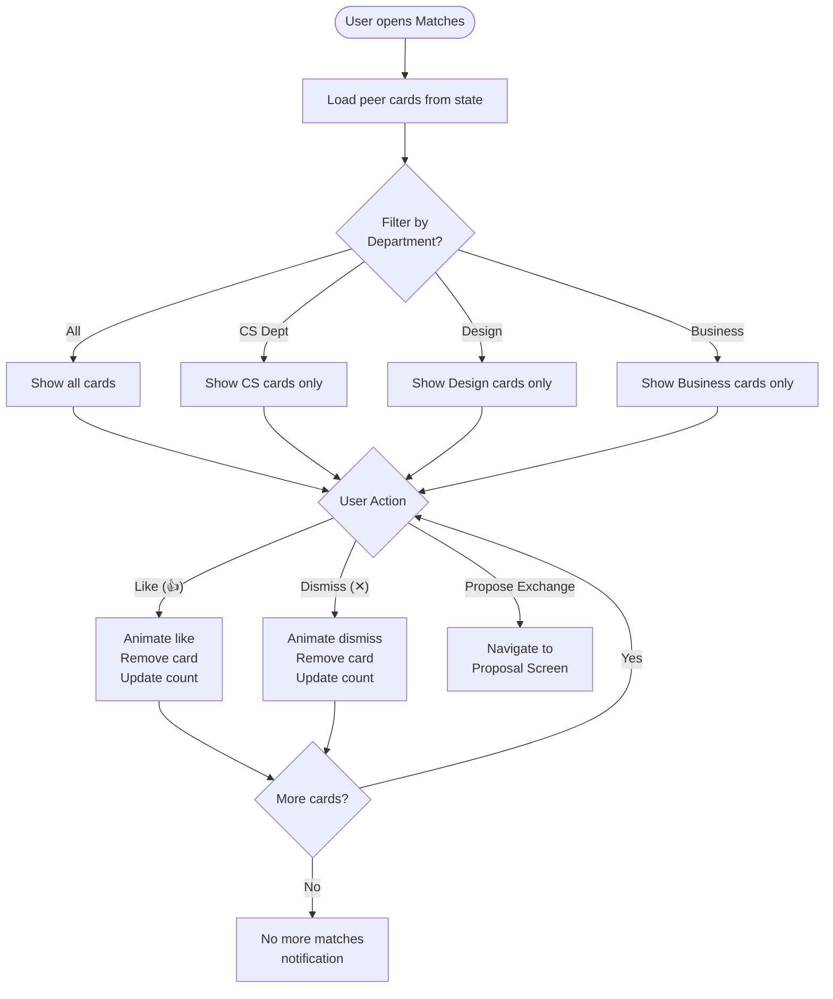
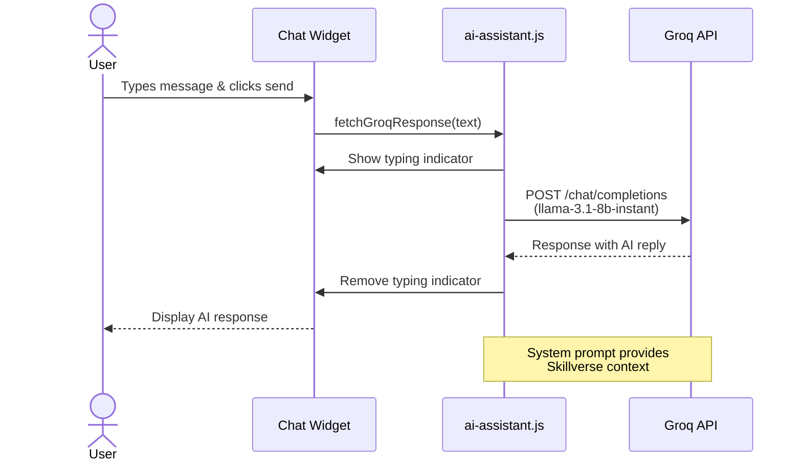
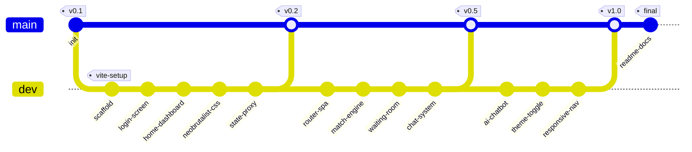
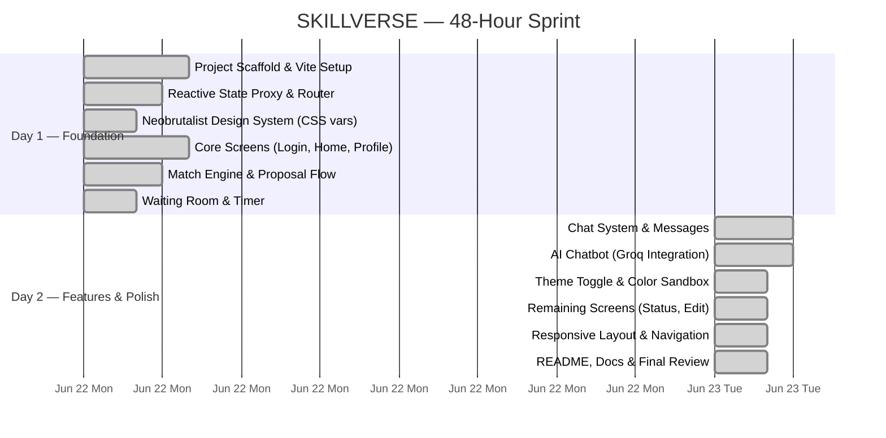

<div align="center">
  <br/>
  <pre>
  ╔══════════════════════════════════════════════════════╗
  ║                                                      ║
  ║   ███████╗██╗  ██╗██╗██╗     ██╗   ██╗███████╗     ║
  ║   ██╔════╝██║ ██╔╝██║██║     ██║   ██║██╔════╝     ║
  ║   ███████╗█████╔╝ ██║██║     ██║   ██║█████╗       ║
  ║   ╚════██║██╔═██╗ ██║██║     ╚██╗ ██╔╝██╔══╝       ║
  ║   ███████║██║  ██╗██║███████╗ ╚████╔╝ ███████╗     ║
  ║   ╚══════╝╚═╝  ╚═╝╚═╝╚══════╝  ╚═══╝  ╚══════╝     ║
  ║                                                      ║
  ╚══════════════════════════════════════════════════════╝
  </pre>

  <h1 align="center">SKILLVERSE</h1>
  <p align="center">
    <strong>Student Skill Exchange Platform</strong>
    <br/>
    <em>Learn. Teach. Grow.</em>
  </p>

  <br/>

  <p align="center">
    <a href="#-features"><strong>Features</strong></a> •
    <a href="#-tech-stack"><strong>Tech Stack</strong></a> •
    <a href="#-architecture"><strong>Architecture</strong></a> •
    <a href="#-quick-start"><strong>Quick Start</strong></a> •
    <a href="#-screens"><strong>Screens</strong></a> •
    <a href="#-contributors"><strong>Team</strong></a>
  </p>

  <br/>

  <!-- BADGES -->
  <p>
    
    
    
    
    
    
    
    
    
    
    <a href="LICENSE"></a>
  </p>

  <br/>
</div>

---

## 📋 Overview

**SKILLVERSE** is a sophisticated **student-to-student skill exchange platform** that reimagines peer learning through a neobrutalist lens. Built with **vanilla JavaScript**, **Vite 5**, and a custom **reactive state management** system, the platform delivers a seamless single-page application experience across **10 interactive screens** — from authentication to live chat.

> 🎓 **Academic Project** — Developed by Team **AC-DC** as part of the VIT Bhopal University curriculum. This project demonstrates advanced frontend engineering patterns including component-based SPA routing, reactive state proxies, real-time AI integration, and a modular CSS design system.

### ✨ Why SKILLVERSE?

| | |
|---|---|
| **🎯 Peer-to-Peer Learning** | Connect students with complementary skills for knowledge exchange |
| **🤖 AI-Powered Assistance** | Integrated Groq AI chatbot (Llama 3.1) provides intelligent guidance |
| **🎨 Neobrutalist Design** | A bold, distinctive visual identity that stands out from conventional UIs |
| **⚡ Reactive Architecture** | Custom Proxy-based state management without any frameworks |
| **📱 Full User Journey** | 10 interconnected screens covering the complete skill exchange lifecycle |

---

## 📑 Table of Contents

- [Features](#-features)
- [Tech Stack](#-tech-stack)
- [Architecture](#-architecture)
- [Quick Start](#-quick-start)
- [Screens Walkthrough](#-screens-walkthrough)
- [Project Structure](#-project-structure)
- [Contributors](#-contributors)
- [Development Timeline](#-development-timeline)
- [License](#-license)

---

## 🚀 Features

### Core Screens

| # | Screen | Description |
|:---:|---|---|
| 1 | **Login** | Student email/password sign-in with Google Auth simulation |
| 2 | **Home Dashboard** | Welcome banner, stats grid, upcoming sessions, quick actions |
| 3 | **Waiting Room** | Pre-call lobby with countdown timer, camera/mic toggles, video simulation |
| 4 | **Student Profile** | Avatar, rating, streak, teach/learn badges |
| 5 | **Edit Profile** | Display name, bio, department, notification/match preferences, log out |
| 6 | **Match Engine** | AI-powered peer cards with department filters, like/dismiss, match percentage |
| 7 | **Exchange Proposal** | Skill swap summary, duration/format selectors |
| 8 | **Success Status** | Confirmation screen with navigation to chat or home |
| 9 | **Chats Directory** | Searchable list of active conversations |
| 10 | **Live Chatroom** | Real-time messaging interface with send/enter support |

### 🧩 Additional Components

| Component | Description |
|---|---|
| **AI Chatbot** | 🤖 Floating assistant powered by **Groq API** (Llama 3.1 8B) — context-aware, real-time responses |
| **Theme Toggle** | 🌗 Seamless light/dark mode switching with persistent preference |
| **State Debugger** | 🔍 Live reactive JSON state viewer for development inspection |
| **Color Sandbox** | 🎨 Real-time neobrutalist color token editor — tweak variables, see changes instantly |
| **Activity Log** | 📋 Console-style event stream recording all application interactions |

---

## 🛠️ Tech Stack

<div align="center">

| Layer | Technology | Purpose |
|:---|---:|---:|
| **Build Tool** |  | Lightning-fast HMR, optimized production builds |
| **Language** |  | Vanilla JS with ES modules — zero framework overhead |
| **Markup** |  | Component templates loaded via `?raw` Vite imports |
| **Styling** |  | Neobrutalist design system with CSS custom properties |
| **Smooth Scroll** |  | Butter-smooth scroll physics |
| **AI Integration** |  | Llama 3.1 8B via Groq's ultra-fast inference |
| **State Management** | — | Custom reactive `Proxy`-based store with change logging |
| **Router** | — | Custom hash-based SPA router with dynamic component injection |
| **Fonts** | — | **Outfit** (headers), **Inter** (body) — loaded from Google Fonts |

</div>

---

## 🏗️ Architecture

### System Architecture



### Data Flow



### User Journey



---

## ⚡ Quick Start

### Prerequisites

- **Node.js** 18+ (LTS recommended)
- **npm** 9+ (ships with Node.js)

### Setup in 30 Seconds

```bash
# 1. Clone the repository
git clone https://github.com/Rachit-Tiwari-7/SKILLVERSE.git

# 2. Navigate to project
cd SKILLVERSE

# 3. Install dependencies
npm install

# 4. (Optional) Set Groq API key for AI chatbot features
echo "VITE_GROQ_API_KEY=your_groq_api_key" > .env

# 5. Start development server
npm run dev
```

Your browser will open at **👉 [http://localhost:5173](http://localhost:5173)**

### Production Build

```bash
npm run build    # outputs optimized bundle to /dist
npm run preview  # preview production build locally
```

---

## 🎬 Screens Walkthrough

| Screen | Key Interactions |
|---|---|
| **🔐 Login** | Enter credentials or click "Sign In with Google" to access the dashboard |
| **🏠 Home** | View stats, join upcoming session, quick-nav to Matches/Chats/Profile |
| **⏳ Waiting Room** | Toggle mic/camera, watch countdown, click "Join Session" |
| **👤 Profile** | View rating, streak, skills; click EDIT to modify |
| **✏️ Edit Profile** | Update name/bio/dept, toggle notifications, log out |
| **💞 Matches** | Filter by department, like/dismiss cards, propose exchange |
| **📝 Proposal** | Review skill swap, select duration & format, send request |
| **✅ Status** | Success confirmation; navigate to chat or back to home |
| **💬 Messages** | Search conversations, select a chat to open |
| **💭 Chatroom** | Send messages, receive auto-replies from simulated peer |

### Workflow Diagrams

<details>
<summary><strong>🔽 Click to expand: Match Engine Workflow</strong></summary>


</details>

<details>
<summary><strong>🔽 Click to expand: AI Chatbot Request Flow</strong></summary>


</details>

---

## 📁 Project Structure

```
SKILLVERSE/
├── 📄 index.html                 # Entry point — global header, nav, AI widget
├── 📄 package.json               # Vite + Lenis dependencies
├── 📄 package-lock.json
├── 📄 .gitignore
├── 📄 .env                       # (create this) VITE_GROQ_API_KEY=your_key
├── 📄 README.md
└── 📂 src/
    ├── 📄 main.js                # App bootstrapper, event bindings, Lenis init
    ├── 📄 state.js               # Reactive state proxy with logging
    ├── 📄 router.js              # SPA navigation, screen switching, chat rendering
    ├── 📄 chatbot.js             # Chat message send/receive logic
    ├── 📄 timer.js               # Waiting room countdown timer
    ├── 📄 ai-assistant.js        # Groq API integration for AI chatbot
    ├── 📂 components/            # Screen templates (.html as raw strings)
    │   ├── 📄 login.html
    │   ├── 📄 home.html
    │   ├── 📄 waiting-room.html
    │   ├── 📄 profile.html
    │   ├── 📄 edit-profile.html
    │   ├── 📄 matches.html
    │   ├── 📄 proposal.html
    │   ├── 📄 status.html
    │   ├── 📄 messages.html
    │   └── 📄 chat.html
    └── 📂 styles/                # Modular CSS files
        ├── 📄 variables.css
        ├── 📄 main.css
        ├── 📄 header.css
        ├── 📄 login.css
        ├── 📄 home.css
        ├── 📄 waiting-room.css
        ├── 📄 profile.css
        ├── 📄 edit-profile.css
        ├── 📄 matches.css
        ├── 📄 proposal.css
        ├── 📄 status.css
        ├── 📄 chat.css
        └── 📄 ai-chatbot.css
```

---

## 👥 Contributors

### Team AC-DC

<div align="center">

| | Name | Role | Contributions |
|:---:|---|---|---|
| **👤** | **Rachit Tiwari** | Lead Developer | Architecture, State Management, Router, Chat System, AI Integration |
| **👤** | **Mausam Kar** | Frontend Developer | Component Screens, CSS Design System, Match Engine, Timer |
| **👤** | **Shaikh Mohammad Warsi** | UI/UX Developer | Login, Profile, Edit Profile, Proposal, Status Screens |
| **👤** | **Jiya Jaiswal** | Frontend Developer | Home Dashboard, Messages, Waiting Room, Responsive Layout |

</div>

### Contribution Graph



---

## 📅 Development Timeline — 48‑Hour Hackathon Sprint

> Built from scratch in a 2‑day sprint (June 22–23, 2026). Every task below was planned, implemented, and polished within this window.



---

## 📄 License

This project is licensed under the **AC-DC Academic License**. See the [LICENSE](LICENSE) file for details.

---

## 🙌 Support

- **Report Issues**: [GitHub Issues](https://github.com/Rachit-Tiwari-7/SKILLVERSE/issues)
- **Contribute**: Fork the repo and submit a PR — all contributions welcome!
- **Contact**: Reach out to any of the team members above

---

<div align="center">
  <sub>
    Built with ❤️ by <strong>Team AC-DC</strong> — VIT Bhopal University
  </sub>
  <br/>
  <br/>
  <sub>
    <strong>SKILLVERSE</strong> &bull; <em>Learn. Teach. Grow.</em>
  </sub>
</div>
