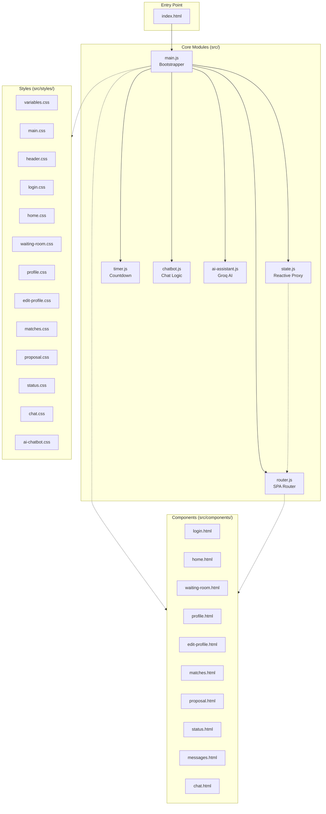
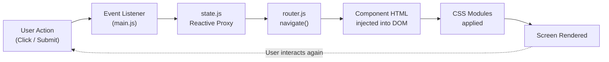
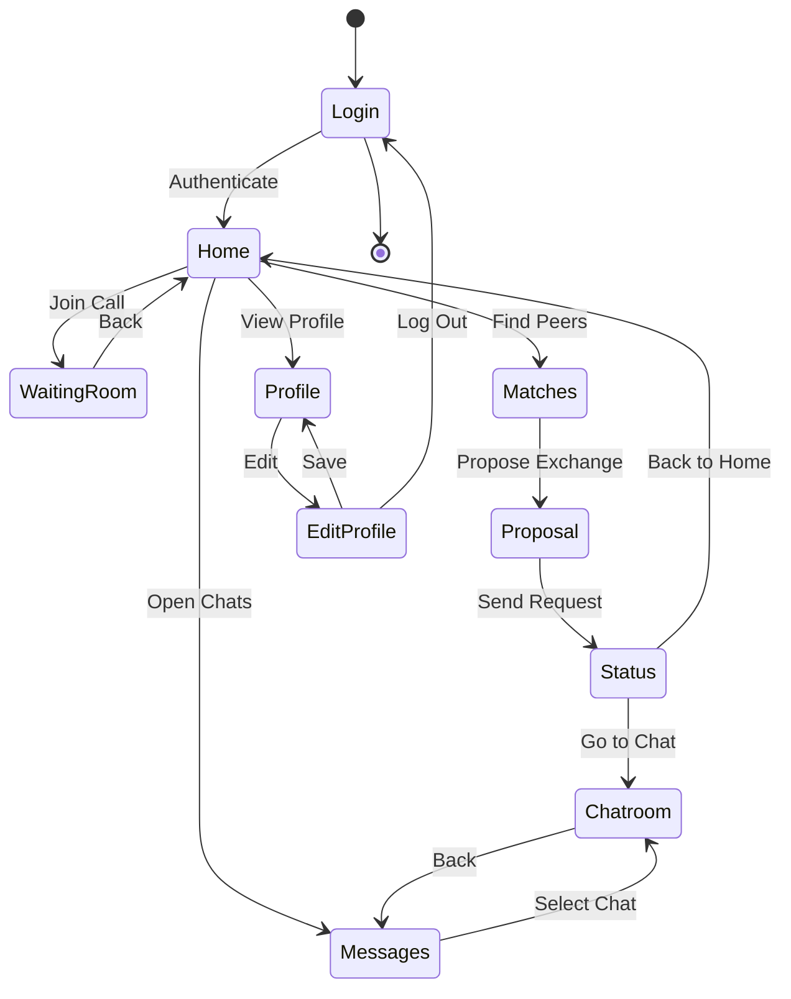
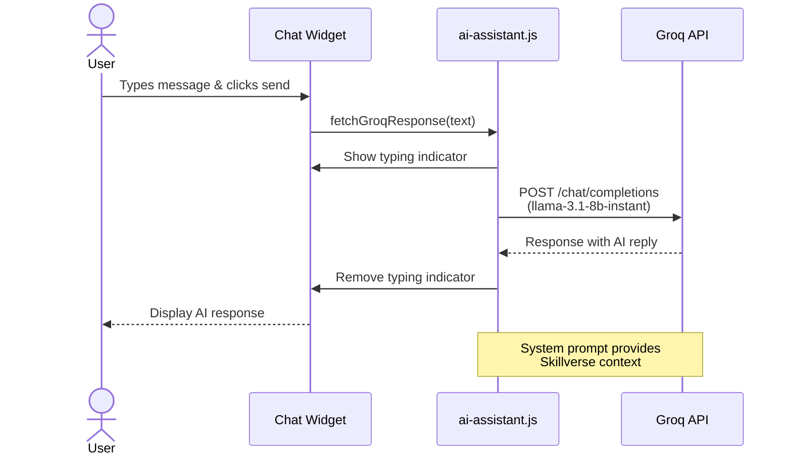

# SKILLVERSE — Student Skill Exchange Platform


---

> **Note for Evaluators:**  
> This project — **SKILLVERSE** — is a student skill exchange platform built as part of the academic curriculum. It features a **neobrutalist design system**, a **modular Vite + vanilla JS architecture**, and **10 interactive screens** that simulate the complete user journey — from login to live chat. The platform demonstrates reactive state management, component-based routing, an AI chatbot assistant (Groq API), and a real-time waiting room simulator. We encourage you to explore the full flow: *Login → Home → Matches → Proposal → Status → Chats → Profile*.

---

## Team AC-DC

| Role | Name |
|---|---|
| **Developer** | **Rachit Tiwari** |
| **Developer** | **Mausam Kar** |
| **Developer** | **Shaikh Mohammad Warsi** |
| **Developer** | **Jiya Jaiswal** |

---

## Architecture Overview



### Data Flow



### User Journey Flow



---

## Flowcharts

### Match Engine Workflow


### AI Chatbot Request Flow



---

## Features

| # | Screen | Description |
|---|---|---|
| 1 | **Login** | Student email/password sign-in with Google Auth simulation |
| 2 | **Home Dashboard** | Welcome banner, stats grid, upcoming sessions, quick actions |
| 3 | **Waiting Room** | Pre-call lobby with countdown timer, camera/mic toggles, video simulation |
| 4 | **Student Profile** | Avatar, rating, streak, teach/learn badges |
| 5 | **Edit Profile** | Display name, bio, department, notification/match preferences, log out |
| 6 | **Match Engine** | AI-powered peer cards with department filters, like/dismiss, match percentage |
| 7 | **Exchange Proposal** | Skill swap summary, duration/format selectors |
| 8 | **Success Status** | Confirmation screen with navigation to chat or home |
| 9 | **Chats Directory** | Searchable list of active conversations |
| 10 | **Live Chatroom** | Real-time messaging interface with send/enter support |

### Additional Components

| Component | Description |
|---|---|
| **AI Chatbot** | Floating assistant powered by Groq API (Llama 3.1 8B) |
| **Theme Toggle** | Light/Dark mode switcher |
| **State Debugger** | Live reactive JSON state viewer |
| **Color Sandbox** | Real-time neobrutalist color token editor |
| **Activity Log** | Console-style event stream |

---

## Tech Stack

| Layer | Technology |
|---|---|
| **Build Tool** | Vite 5 |
| **Language** | Vanilla JavaScript (ES Modules) |
| **Markup** | HTML (component strings via `?raw` import) |
| **Styling** | CSS with Custom Properties (neobrutalist design system) |
| **Smooth Scroll** | Lenis |
| **AI Integration** | Groq API (Llama 3.1 8B) |
| **State Management** | Reactive Proxy (custom) |
| **Router** | Custom hash-based SPA router |
| **Fonts** | Outfit (headers), Inter (body) |

---

## Project Structure

```
SKILLVERSE/
├── index.html                 # Entry point with global header, nav, AI widget
├── package.json               # Vite + Lenis dependencies
├── package-lock.json
├── .gitignore
├── .env                       # (create this) VITE_GROQ_API_KEY=your_key
├── README.md
└── src/
    ├── main.js                # App bootstrapper, event bindings, Lenis init
    ├── state.js               # Reactive state proxy with logging
    ├── router.js              # SPA navigation, screen switching, chat rendering
    ├── chatbot.js             # Chat message send/receive logic
    ├── timer.js               # Waiting room countdown timer
    ├── ai-assistant.js        # Groq API integration for AI chatbot
    ├── components/            # Screen templates (.html loaded as raw strings)
    │   ├── login.html
    │   ├── home.html
    │   ├── waiting-room.html
    │   ├── profile.html
    │   ├── edit-profile.html
    │   ├── matches.html
    │   ├── proposal.html
    │   ├── status.html
    │   ├── messages.html
    │   └── chat.html
    └── styles/                # Modular CSS files
        ├── variables.css
        ├── main.css
        ├── header.css
        ├── login.css
        ├── home.css
        ├── waiting-room.css
        ├── profile.css
        ├── edit-profile.css
        ├── matches.css
        ├── proposal.css
        ├── status.css
        ├── chat.css
        └── ai-chatbot.css
```

---

## Setup & Run

### Prerequisites

- Node.js 18+
- npm 9+

### Installation

```bash
# Clone the repository
git clone https://github.com/Rachit-Tiwari-7/SKILLVERSE.git
cd SKILLVERSE

# Install dependencies
npm install

# (Optional) Set Groq API key for AI chatbot
echo "VITE_GROQ_API_KEY=your_groq_api_key" > .env

# Start development server
npm run dev
```

The app will be available at **http://localhost:5173**

### Build for Production

```bash
npm run build    # outputs to /dist
npm run preview  # preview production build
```

---

## Screens Walkthrough

| Screen | Key Interactions |
|---|---|
| **Login** | Enter credentials or click "Sign In with Google" to access the dashboard |
| **Home** | View stats, join upcoming session, quick-nav to Matches/Chats/Profile |
| **Waiting Room** | Toggle mic/camera, watch countdown, click "Join Session" |
| **Profile** | View rating, streak, skills; click EDIT to modify |
| **Edit Profile** | Update name/bio/dept, toggle notifications, log out |
| **Matches** | Filter by department, like/dismiss cards, propose exchange |
| **Proposal** | Review skill swap, select duration & format, send request |
| **Status** | Success confirmation; navigate to chat or back to home |
| **Messages** | Search conversations, select a chat to open |
| **Chatroom** | Send messages, receive auto-replies from simulated peer |

---

## License

### AC-DC Academic License

Copyright &copy; 2026 **Team AC-DC**

All rights reserved. This project is developed solely for **academic evaluation purposes** as part of the curriculum at **VIT Bhopal University**.

**Permissions:**
- Viewing and evaluating the source code by authorized faculty and evaluators
- Academic reference and study

**Restrictions:**
- No commercial use, distribution, or publication without prior written consent from the team
- No reproduction or redistribution of the codebase, in whole or in part, for any purpose outside academic evaluation
- No removal or alteration of this license notice

**Attribution:**

This project — **SKILLVERSE Student Skill Exchange Platform** — is the original work of:

| Name | Role |
|---|---|
| **Rachit Tiwari** | Developer |
| **Mausam Kar** | Developer |
| **Shaikh Mohammad Warsi** | Developer |
| **Jiya Jaiswal** | Developer |

*Team AC-DC — VIT Bhopal University*

---

<p align="center">SKILLVERSE &bull; Learn. Teach. Grow.</p>
